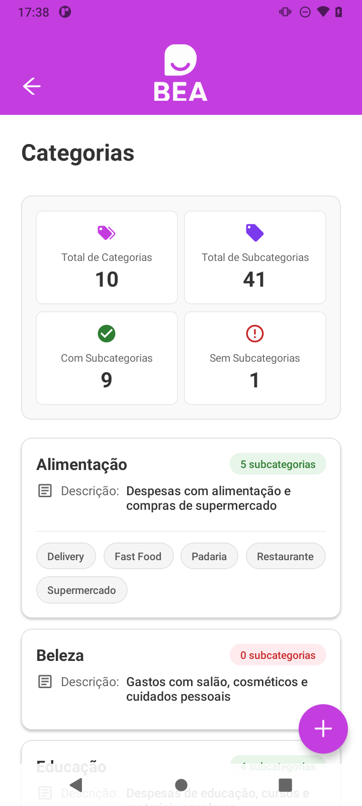

<p align="center">
  
</p>

<h1 align="center">BEA — Gestão Financeira Empresarial</h1>

<p align="center">
  Aplicativo mobile para controle financeiro multi-usuário, desenvolvido com React Native, Expo e Supabase.
</p>

<p align="center">
  
  
  
  
  
</p>

---

## Telas

<p align="center">
  
  &nbsp;&nbsp;&nbsp;&nbsp;
  
</p>
<p align="center">
  <em>Splash Screen animada &nbsp;&nbsp;&nbsp;&nbsp;&nbsp;&nbsp;&nbsp;&nbsp;&nbsp;&nbsp;&nbsp;&nbsp;&nbsp;&nbsp;&nbsp;&nbsp;&nbsp;&nbsp;&nbsp;&nbsp;&nbsp;&nbsp;&nbsp;&nbsp;&nbsp;&nbsp;&nbsp; Lista de Categorias com subcategorias</em>
</p>

---

## Sobre o Projeto

O **BEA** é uma aplicação mobile voltada para pequenas e médias empresas que precisam organizar seus gastos de forma colaborativa. O dono da empresa (**owner**) pode cadastrar dependentes (colaboradores), definir categorias de despesas, finalidades e métodos de pagamento — criando um ecossistema completo de controle financeiro com acesso por perfil.

---

## Funcionalidades

| Módulo | Descrição |
|---|---|
| **Autenticação** | Cadastro e login com e-mail/senha via Supabase Auth |
| **Controle de Acesso** | Perfis distintos: `owner` (gestor) e `dependent` (colaborador) |
| **Dependentes** | CRUD de colaboradores vinculados à empresa |
| **Métodos de Pagamento** | Cadastro de cartões (crédito, débito, pré-pago), PIX, dinheiro e transferência — com bandeira, titular, vencimento e fechamento |
| **Categorias** | Criação de categorias e subcategorias para classificar despesas |
| **Finalidades** | Visualização de propósitos de gastos por empresa |
| **Perfil** | Edição de nome e e-mail do usuário autenticado |
| **Tema** | Suporte completo a Dark Mode e Light Mode |

---

## Arquitetura & Decisões Técnicas

O projeto segue uma arquitetura **modular por feature**, separando responsabilidades de forma escalável:

```
src/
├── modules/          # Telas organizadas por domínio (auth, categories, expenses…)
│   └── [feature]/
│       ├── index.tsx         # Lógica e UI da tela
│       └── style[Name].ts    # Estilos com Styled Components
├── components/       # Biblioteca de componentes reutilizáveis
├── contexts/         # Estado global com Context API (Auth, Notification, Drawer)
├── services/         # Camada de serviço isolada para chamadas ao Supabase
└── types/            # Contratos TypeScript por domínio
```

**Destaques de implementação:**

- **Expo Router** com roteamento baseado em arquivos e tipagem de rotas (`typedRoutes`)
- **AuthGuard** reativo — redireciona automaticamente baseado no estado de autenticação
- **Row Level Security (RLS)** no Supabase garantindo isolamento de dados por empresa
- **Animated Splash Screen** com `react-native-reanimated` (slide-out ao carregar)
- **StepIndicator** para formulários multi-etapas (ex: cadastro de método de pagamento)
- **React Compiler** habilitado (`experiments.reactCompiler: true`) para otimização automática de renders
- Variáveis de ambiente via `.env` — nenhuma credencial hardcoded no código-fonte

---

## Stack Tecnológica

- **React Native 0.81** + **Expo 54** (New Architecture habilitada)
- **TypeScript** em todo o projeto
- **Expo Router 6** — file-based routing com suporte a modais, tabs e stacks
- **Supabase** — autenticação, banco PostgreSQL e RLS
- **Styled Components** — estilização com suporte a temas
- **React Native Reanimated 4** — animações de alta performance
- **Ant Design React Native** — componentes de UI
- **Context API** — gerenciamento de estado global sem bibliotecas externas

---

## Como Rodar Localmente

### Pré-requisitos

- Node.js 18+
- Expo CLI
- Conta no [Supabase](https://supabase.com)

### Instalação

```bash
# Clone o repositório
git clone https://github.com/seu-usuario/bea-app.git
cd bea-app

# Instale as dependências
npm install
```

### Variáveis de Ambiente

Copie o arquivo de exemplo e preencha com suas credenciais do Supabase:

```bash
cp .env.example .env
```

| Variável | Descrição |
|---|---|
| `EXPO_PUBLIC_SUPABASE_URL` | URL do seu projeto Supabase |
| `EXPO_PUBLIC_SUPABASE_ANON_KEY` | Chave anônima (pública) |
| `SUPABASE_SERVICE_ROLE_KEY` | Chave de service role (somente local) |
| `SUPABASE_ACCESS_TOKEN` | Token de acesso à API do Supabase |
| `TEST_USER_EMAIL` | E-mail do usuário de teste (scripts) |
| `TEST_USER_PASSWORD` | Senha do usuário de teste (scripts) |

> ⚠️ **Nunca** compartilhe ou comite `SUPABASE_SERVICE_ROLE_KEY`. Ela tem privilégios administrativos completos.

### Executando

```bash
# Expo Go / simulador
npx expo start

# Android (build nativo)
npx expo run:android
```

### Scripts de Teste

```bash
npm run test:connection   # Testa a conexão com o Supabase
npm run test:database     # Verifica o banco de dados
npm run test:tables       # Lista tabelas disponíveis
npm run test:supabase     # Suite completa
```

---

## Licença

Distribuído sob a licença MIT.

